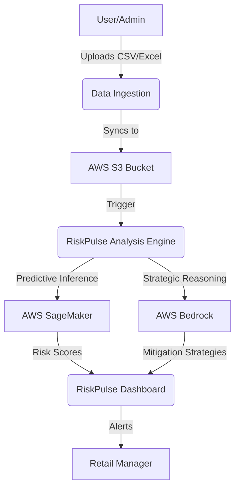
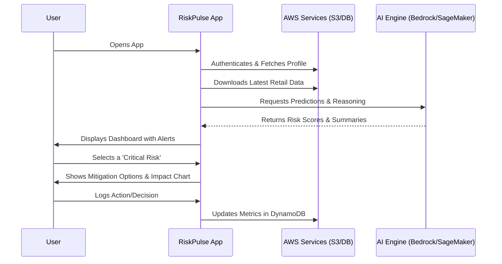

# RiskPulse - AI-Driven Retail Risk Prediction & Mitigation

**RiskPulse** is a high-performance, AI-driven decision support system built with **Flutter** and **AWS**. It is designed specifically for retail executives and supply chain managers to predict, visualize, and mitigate operational risks that could lead to "retail failure" (e.g., stockouts, logistics breakdowns, or revenue loss).

## 🎯 Purpose of the App

The primary goal of RiskPulse is to transform raw retail data into **actionable intelligence**. It uses **predictive modeling** and **generative AI** to provide:
- **Predictive Risk Assessment**: Identify product categories at high risk of revenue drop.
- **Propagation Analysis**: Understand how a delay in one area (e.g., fulfillment) affects others (e.g., inventory).
- **Automated Mitigation Planning**: Get AI-generated strategic options to solve operational bottlenecks.

## 🏗️ Technical Architecture

- **Frontend**: Flutter (Cross-platform) using **Riverpod** for state management and **GoRouter**.
- **AI/ML (AWS)**:
    - **AWS Bedrock (Claude 3 Haiku)**: Generates executive summaries and mitigation strategies.
    - **AWS SageMaker**: Hosts predictive analytics models for risk scoring.
- **Backend & Storage**:
    - **AWS S3**: Secure storage for retail datasets.
    - **AWS DynamoDB**: Stores user profiles, metrics, and activity logs.
    - **AWS Signature V4**: Secure API communication.

## 🔄 Project Flows

### System Architecture Flow


### User Interaction Flow


## 📊 Key Features

| Feature | Description |
| :--- | :--- |
| **Real-time Risk Dashboard** | Visualization of "Active Risks" and "Revenue at Risk" using `fl_chart`. |
| **AI Executive Summary** | Bedrock-generated insights explaining the *root cause* of risk. |
| **Propagation Scoring** | Deep-dive metrics into how risks spread across inventory and revenue. |
| **Mitigation Strategies** | Ranked options with Cost vs. Timeline trade-offs. |
| **S3 Sync** | Automatic synchronization with cloud-hosted operational data. |

## 🛠️ Getting Started

1. **Prerequisites**: Ensure Flutter is installed.
2. **AWS Config**: Update `lib/core/aws_config.dart` with your AWS credentials if necessary (avoid hardcoding in production).
3. **Run**:
   ```bash
   flutter pub get
   flutter run
   ```
